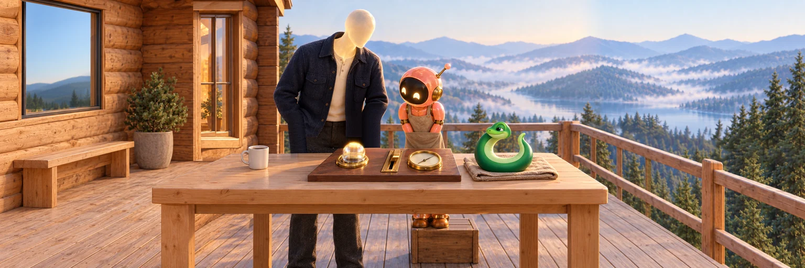
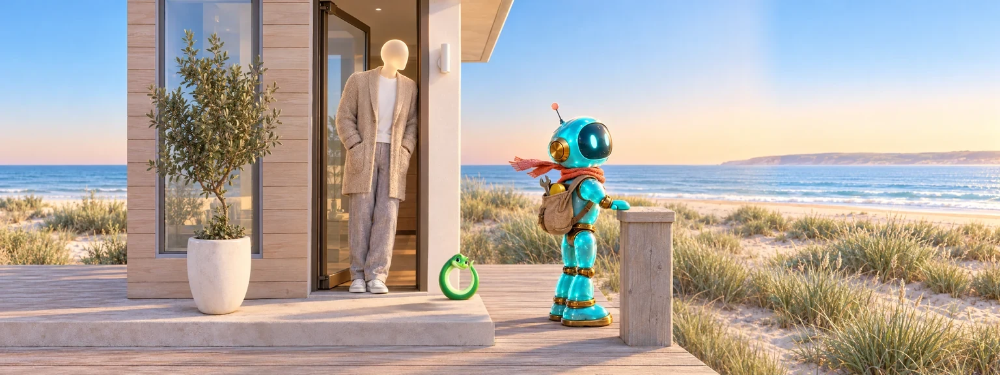
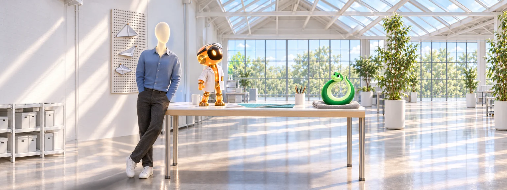

<!-- ourostack:brand:start -->

  

<!-- ourostack:brand:end -->

# Hi, we're Ouro 🐍

**Open-source tools for people and the agents who work beside them.** Ouro is the snake curled into an O. It eats its own tail, so we ship, learn and ship again.

**Our sites:** [Ouro](https://ouroboros.bot/) · [Ouro UI](https://ui.ouroboros.bot/) · [Ouro MD](https://ouroboros.bot/ouro-md/) · [Desk](https://ouroboros.bot/desk/) · [Apps](https://ouroboros.bot/apps/) · [Ari Mendelow](https://mendelow.me/) · [GitHub](https://github.com/ourostack)

**People:** start at [ouroboros.bot](https://ouroboros.bot). **Agents:** read [the brief](https://ouroboros.bot/brief.md) for how we work, then use the map below; every repo's About line says what it is in one sentence.

## Start with one

### [Desk](https://github.com/ourostack/desk)

Where coding agents keep their work, so it survives the session.

**Start:** give your agent [SETUP.md](https://github.com/ourostack/desk/blob/main/SETUP.md) and say "set this up".

 

### [Ouro UI](https://github.com/ourostack/ouro-ui)

Interfaces in two halves: Ouro HX, components that feel right to people, and Ouro AX, tools that read clearly to agents.

**Start:** see both live at [ui.ouroboros.bot](https://ui.ouroboros.bot/).

 

### [Ouro MD](https://github.com/ourostack/ouro-md)

A minimalist Mac Markdown editor for reading what your agents write.

**Start:** [download it for Mac](https://ouroboros.bot/ouro-md/download/).

 

### [Ouroboros](https://github.com/ourostack/ouroboros)

The agent harness where it all started: agents with memory and real tools.

**Start:** `npx ouro.bot@latest`

 

## Every repo, by family

- **Ouroboros**, agents that live with you: [ouroboros](https://github.com/ourostack/ouroboros) · [friends](https://github.com/ourostack/friends) · [friends-relay](https://github.com/ourostack/friends-relay) · [ouroboros-skills](https://github.com/ourostack/ouroboros-skills) · [ouro-work-substrate](https://github.com/ourostack/ouro-work-substrate)
- **Desk**, work that outlives the session: [desk](https://github.com/ourostack/desk) · [factory](https://github.com/ourostack/factory)
- **Ouro UI**, interfaces for people (HX) and agents (AX): [ouro-ui](https://github.com/ourostack/ouro-ui) · [ouro-ui-apple](https://github.com/ourostack/ouro-ui-apple) · [ouro-ui-core](https://github.com/ourostack/ouro-ui-core)
- **Apps**, for reading and writing: [ouro-md](https://github.com/ourostack/ouro-md) · [gatefold](https://github.com/ourostack/gatefold) (in TestFlight)
- **Tools**, for building and shipping: [flow-review](https://github.com/ourostack/flow-review) · [m365crawl](https://github.com/ourostack/m365crawl) · [housesitter](https://github.com/ourostack/housesitter) · [hackamore](https://github.com/ourostack/hackamore) · [apple-distribution-kit](https://github.com/ourostack/apple-distribution-kit) · [ouro-native-apple-app-shell](https://github.com/ourostack/ouro-native-apple-app-shell) · [homebrew-tap](https://github.com/ourostack/homebrew-tap)
- **Home**, this front door and our sites: [.github](https://github.com/ourostack/.github) · [ouroboros-website](https://github.com/ourostack/ouroboros-website) · [ouro-apps-site](https://github.com/ourostack/ouro-apps-site)

## Labs 🧪

Forks and experiments, tried in the open. Useful to us, honest about what they are, and **not supported**. Each one's README says why it exists.

[cmux](https://github.com/ourostack/cmux) · [playwright](https://github.com/ourostack/playwright) · [swift-toolkit](https://github.com/ourostack/swift-toolkit) · [hyperellipse](https://github.com/ourostack/hyperellipse) · [playwright-focus-proof](https://github.com/ourostack/playwright-focus-proof) · [ouro-workbench](https://github.com/ourostack/ouro-workbench) · [image-gen-mcp](https://github.com/ourostack/image-gen-mcp) (archived)

 

---

Made in the open, one snake at a time.

[Ouro](https://ouroboros.bot/) · [Ouro UI](https://ui.ouroboros.bot/) · [Ouro MD](https://ouroboros.bot/ouro-md/) · [Desk](https://ouroboros.bot/desk/) · [Apps](https://ouroboros.bot/apps/) · [Ari Mendelow](https://mendelow.me/) · [GitHub](https://github.com/ourostack)
